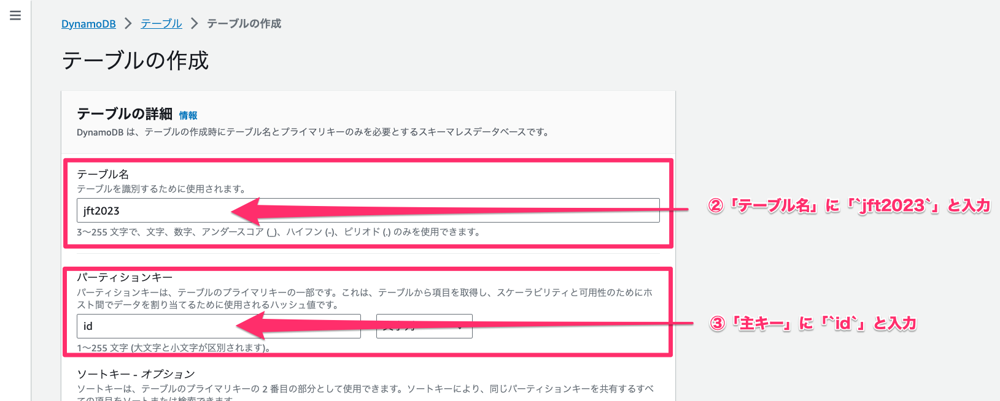
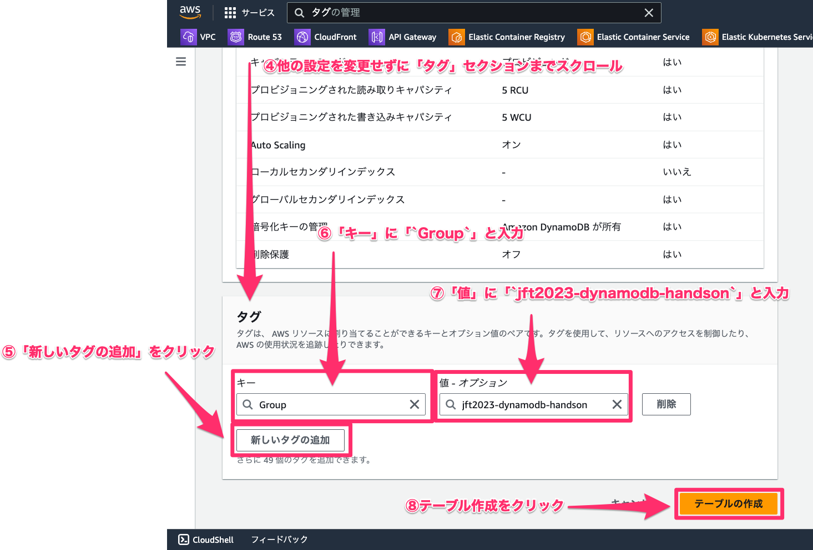
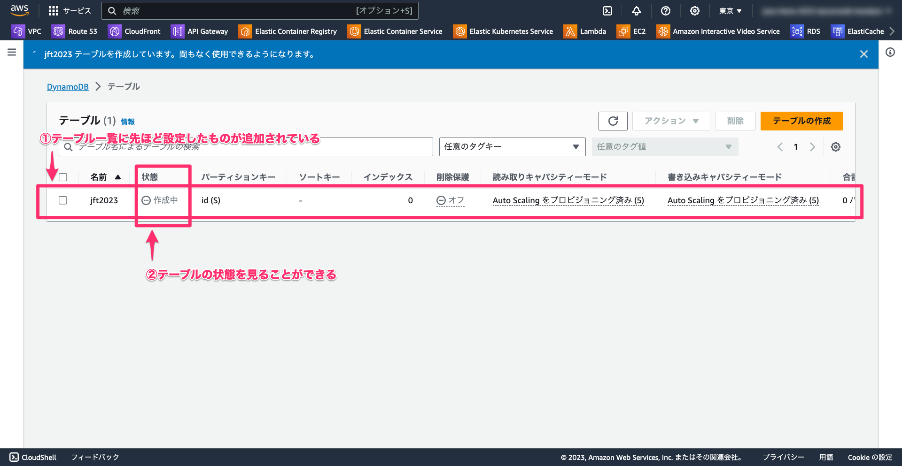
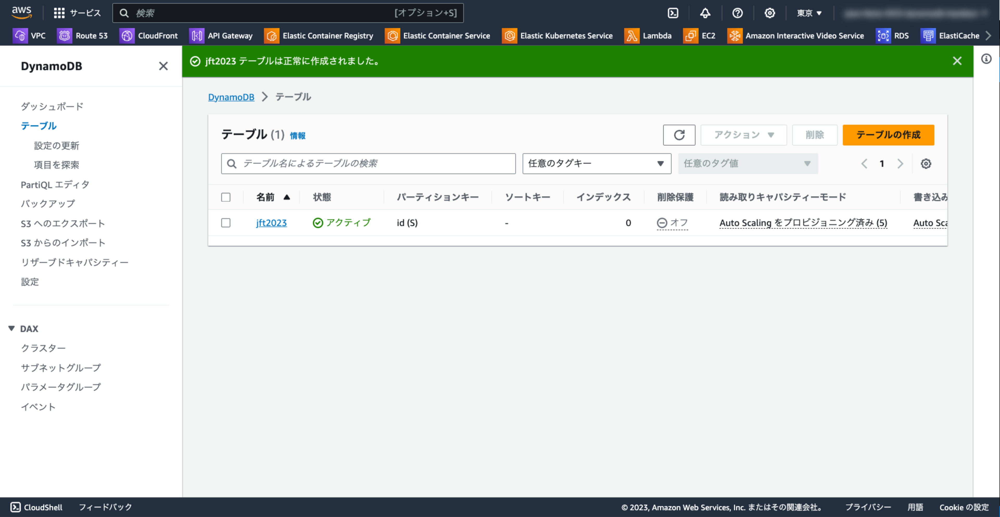
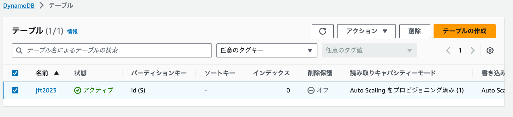

# はじめに

この資料は JAWS FESTA 2023 Kyushu で行われるハンズオンために書かれました。

イベントページは[こちら](https://jft2023.jaws-ug.jp/)。

手を動かしながら Amazon DynamoDB の基本を学ぶことができます。

この資料のマスタは[こちら](https://github.com/yukinissie/jaws-festa-2023-dynamodb-handson/blob/main/README.md)にあります。

# 自己紹介

- 登壇者名
  - ニッシー ☆ === 西勇樹（Nishi Yuki）
- 所属
  - 株式会社ユーザベース
  - ソーシャル経済メディア「NewsPicks」の Web 版を作っています。
- 登壇者概要
  - 会場である福岡工業大学を今年卒業しました。学生時代は月 1 でハッカソンに行きまくり、つど AWS などのクラウドサービスを利用して爆速でリリースサイクルを回せるような基盤づくりの実装を楽しんでいました。

---

- SNS リンク
  - 𝕏 (Twitter)：https://twitter.com/yukinissie
  - Facebook：https://www.facebook.com/yukinissie
  - GitHub：https://github.com/yukinissie

---

@[TOC](アジェンダ)

# 1. 座学編[30]

## 1-1. Amazon DynamoDB の基本[5]

Amazon DynamoDB(以下、DynamoDB) は高速で予測可能なパフォーマンスやシームレスなスケーラビリティを提供するフルマネージドでサーバーレスの key-value NoSQL データベースサービスです。

### 1-1-1. DynamoDB の利点[5]

以下のような利点があります。

- 分散データベースの運用やスケーリングにかかる管理負荷を軽減
- ハードウェアのプロビジョニング、セットアップと設定、レプリケーション、ソフトウェアのパッチ適用、クラスタのスケーリングなどを心配する必要がなくなる

### 1-1-2. DynamoDB の特徴[5]

DynamoDB では以下のような特徴があります。

- 任意の量のデータを格納および取得し、任意のレベルのリクエストトラフィックに対応できるデータベーステーブルの作成
- ダウンタイムやパフォーマンスの低下なしに、テーブルのスループット容量をスケールアップまたはスケールダウン
- AWS Management Console を使用した、リソースの使用率とパフォーマンスメトリクスの監視
- 他にもたくさんの特徴があります
  - 詳細：AWS 公式サイト「[Amazon DynamoDB の特徴](https://aws.amazon.com/jp/dynamodb/features/)」

### 1-1-3. DynamoDB の機能[5]

DynamoDB では以下のような機能が提供されています。

- オンデマンドバックアップ機能
  - 完全なバックアップを作成できる
  - 詳細：AWS 公式ドキュメント「[DynamoDB のオンデマンドバックアップおよび復元の使用](https://docs.aws.amazon.com/ja_jp/amazondynamodb/latest/developerguide/BackupRestore.html)」
- ポイントインタイムリカバリ機能
  - リアルタイムでバックアップし任意の時点にテーブルを復元できる
  - 詳細：AWS 公式ドキュメント「[ポイントインタイムリカバリ: 仕組み](https://docs.aws.amazon.com/ja_jp/amazondynamodb/latest/developerguide/PointInTimeRecovery_Howitworks.html)」
- 期限切れの項目をテーブルから自動的に削除する機能
  - 詳細：AWS 公式ドキュメント 「[DynamoDB の有効期限 (TTL) を使用して項目を期限切れにする](https://docs.aws.amazon.com/ja_jp/amazondynamodb/latest/developerguide/TTL.html)」

### 1-1-4. DynamoDB の高い可用性と耐久性[5]

- 一貫性のある高速なパフォーマンスを維持しながら、スループットとストレージ要件を処理するために十分な数のサーバーにテーブルのデータとトラフィックを自動的に分散する
- すべてのデータはソリッドステートディスク(SSD)に保存され、AWS リージョン内の複数の [アベイラビリティーゾーン（AZ）](https://docs.aws.amazon.com/ja_jp/AWSEC2/latest/UserGuide/using-regions-availability-zones.html) に自動的にレプリケートされ、ビルトインの高可用性とデータの耐久性を提供する
- グローバルテーブルを使用すると、AWS リージョン間で DynamoDB のテーブルを同期させることが可能
  - 詳細：AWS 公式ドキュメント「[グローバルテーブル – DynamoDB の複数リージョンレプリケーション](https://docs.aws.amazon.com/ja_jp/amazondynamodb/latest/developerguide/GlobalTables.html)」

### 1-1-5. ユースケース[5]

以下のような１秒間に数百万回のリクエストを処理する必要がある業界で使われています。

- アドテック(広告)
- 小売り
- ソフトウェアとインターネット
- ゲーム
- メディアとエンターテイメント
- 銀行と金融

詳細は AWS 公式サイト「[Amazon DynamoDB](https://aws.amazon.com/jp/dynamodb/)」のユースケースセクションをご覧ください。

### 1-1-6. 料金 [5]

DynamoDB の課金対象は大きく分けて以下の 2 つです。

1. DynamoDB テーブル内のデータの読み取り、書き込み、保存
2. 有効化したオプション機能の使用

さらに 1. には「オンデマンド」と「プロビジョニング」という 2 種類のキャパシティモードがあり、それぞれのモードにおけるテーブルの読み書き処理について別個の請求オプションがあります。

#### 無料利用枠（無期限無料）

### 1-1-7. 公式ドキュメント[5]

安心安全 AWS 公式ドキュメントのリンクはこちら ↓

- https://docs.aws.amazon.com/ja_jp/dynamodb/

例えば以下のようなものが載っています。

- [「DynamoDB の使用開始」](https://docs.aws.amazon.com/amazondynamodb/latest/developerguide/GettingStartedDynamoDB.html)
- [「DynamoDB へのアクセス」](https://docs.aws.amazon.com/amazondynamodb/latest/developerguide/AccessingDynamoDB.html)
- [「Programming with DynamoDB」](https://docs.aws.amazon.com/amazondynamodb/latest/developerguide/Programming.html)

今回のハンズオンは公式ドキュメントの内容を元に作成しています。

### 1-1-8. 学習リソース[5]

- [公式チュートリアル](https://aws.amazon.com/jp/dynamodb/getting-started/?nc1=h_ls)
- [API リファレンス](https://docs.aws.amazon.com/ja_jp/amazondynamodb/latest/APIReference/Welcome.html)
  - AWS CLI もしくは AWS SDK から DynamoDB を操作する際に参照する
- [よくある質問](https://aws.amazon.com/jp/dynamodb/faqs/)
- [フォーラム](https://repost.aws/tags/TAljkKQ0MDQJCjDdxSeDQBJw?forumID=131)
  - DynamoDB に関する質問や issue（技術的課題）を投稿することができる
- [公式ブログ](https://aws.amazon.com/jp/blogs/database/tag/dynamodb/)

## DynamoDB の基本用語

### テーブル・項目・属性

- テーブル（Table）
  - DynamoDB はデータをテーブルに保存する
  - テーブルは複数の項目の集合
- 項目（Item）
  - 各テーブルにはゼロ以上の項目が含まれている
  - 項目は他のすべての項目間で一意に識別可能な属性の集合
  - 他のデータベースでいうところの「行（レコード）」に似ている
  - テーブルに保存できる項目数に制限はない

---

- 属性（Attribute）
  - 各項目は 1 つ以上の属性で構成される
  - 属性は基盤となるデータ要素であり、それ以上分割する必要がないものである
  - 他のデータベースでいうところの「列（フィールド）」に似ている
  - プライマリキー以外はスキーマレス
  - 属性のほとんどは 1 つの値のみを持つことができる
    - 例：文字列、数値
  - 一部の項目には、ネストされた属性 (アドレス) がある
    - ネストの深さが最大 32 レベルの属性をサポート

###

# 2. 実習編[60]

## 2-1. DynamoDB サービストップページの開き方[5]

1. AWS コンソールにログインして、ヘッダーにある検索窓をクリックします。


---

2. 検索窓に「DynamoDB」と入力します。
3. 検索結果の中から「DynamoDB」をクリックします。


---

4. DynamoDB サービスのトップページが開きます。


トップページには座学編で説明した内容が書かれています。

## 2-2-1. 【余談】AWS サービスのブックマークの仕方[5]

1. 検索窓にブックマークしたい AWS サービス名（例では「DynamoDB」）を入力します。
2. 検索結果横の星マークをクリックします。
3. ブックマークしたい AWS サービスがブックマークバーに追加されます。


## 2-3. テーブルの作成[15]

では早速、テーブルを作成していきましょう！

### 2-3-1. テーブル一覧を表示する[1]

1. DynamoDB サービスページの左にあるメニュー内の「テーブル」をクリックします。


---

2. そうすることでテーブル一覧を表示することができます。


### 2-3-2. テーブルを作成する[10]

1. 「テーブルの作成」をクリックします。


---

2. 「テーブル名」に「`jft2023`」と入力します。
3. 「主キー」に「`id`」と入力します。



---

4. 他の設定を変更せずに一番下までスクロールします。
5. タグセクションの「新しいタグの追加」をクリックします。
6. 「キー」に「`Group`」と入力します。
7. 「値」に「`jft2023-dynamodb-handson`」と入力します。
8. 「テーブルの作成」をクリックします。

---



### 2-3-3. テーブルの作成状況を確認する[1]

「テーブルの作成」をクリックするとテーブル一覧が表示され、自動的に作成処理が開始されます。テーブルの作成にはしばらく時間がかかりますが、テーブルが作成中かどうかの状態などを一覧から確認できます。通常、1 分程度で完了します。



### 2-3-4. テーブルの作成完了を確認する[1]

作成が完了すると以下のような画面になります。



テーブルを作成できました！🎉

## 2-4. テーブルの概要を知る[10]

テーブルを作成するとテーブル一覧に作成したテーブルが表示されます。



---

テーブルには以下のような情報が表示されています。

- テーブル名
- 状態
- パーティションキー
- ソートキー
- インデックス
- 削除保護
- 読み取りキャパシティモード
- 書き込みキャパシティモード
- テーブルクラス

それぞれの項目について説明していきます。

### 2-4-1. テーブル名[1.5]

テーブル名はテーブルを作成するときに指定した名前が表示されます。

- 命名規則あり
  - すべての名前は UTF-8 を使用してエンコードする必要があり
  - 大文字と小文字が区別される
  - テーブル名とインデックス名の長さは 3 ～ 255 文字
  - 次の文字が使える
    - `a-z`
    - `A-Z`
    - `0-9`
    - `_` (下線)
    - `-` (ダッシュ)
    - `.`（ドット）
- 現在の AWS アカウントとリージョン内で一意である必要がある
  - 例 1）米国東部 (バージニア北部) に People テーブルを作成した場合、米国東部 (バージニア北部) に追加で同名の People テーブルを作成することはできない
  - 例 2）米国東部 (バージニア北部) に People テーブルを作成し、欧州 (アイルランド) に別の People テーブルを作成できるが、これらの 2 つのテーブルは全くの別物である

詳細については、AWS 公式ドキュメント「[Amazon DynamoDB でサポートされるデータ型と命名規則](https://docs.aws.amazon.com/ja_jp/amazondynamodb/latest/developerguide/HowItWorks.NamingRulesDataTypes.html)」を参照してください。

### 2-4-2. 状態[1]

現在のテーブルの状態について知ることができます。AWS SDK for Java V2 では以下のような状態が定義されています。（一部抜粋）

- ACTIVE
- ARCHIVED
- ARCHIVING
- CREATING
- DELETING
- UPDATING

### 2-4-3. パーティションキー[1]

パーティションキーはテーブルのデータを分散させるために使用されるキーです。

- DynamoDB はデータをパーティションに保存する
- パーティションは、AWS リージョン内の複数のアベイラビリティーゾーン間で自動的にレプリケート（複製）される
- パーティション管理は DynamoDB によって完全に処理される
- パーティションを自身が管理する必要はない

### 2-4-4. ソートキー[1]

同じパーティションキー値を持つすべての項目をソートするためのキーです。

- 同じパーティションキーを持つ他の項目とソートキーの昇順で項目が保存される
- テーブルから項目を読み込むには、パーティションのキーバリューとソートキーのキーバリューを指定する必要がある
- 目的の項目に同じパーティションキーバリューがある場合、単一のオペレーション (`Query`) でテーブルから複数の項目を読み取ることができる
- パーティションキーとソートキーが存在するテーブルでは、同じパーティションのキーバリューが複数の項目に割り当てられることがある
- ソートキー値は複数の項目で異なる必要がある

### 2-4-5. インデックス[1]

テーブルにプロビジョニングされたインデックスの数を見ることができます。

### 2-4-6. 削除保護[1]

削除保護はテーブルの削除を防ぐために使用される機能です。

- 削除保護を有効にすると、その間はテーブルを削除することができなくなる

### 2-4-7. 読み取り/書き込みキャパシティモード[1]

読み取りおよび書き込みスループットの課金方法と容量の管理方法を制御します。

- 2 つのキャパシティモードがある
  - オンデマンドモード
  - プロビジョニングモード (デフォルト、無料利用枠の対象)
- テーブルを作成するときに設定できる
- 後から変更することも可能
- セカンダリインデックスは、ベーステーブルのキャパシティモードを継承する
  - 詳細：AWS 公式ドキュメント「[読み込み/書き込みキャパシティモードの変更時の考慮事項](https://docs.aws.amazon.com/ja_jp/amazondynamodb/latest/developerguide/switching.capacitymode.html)」
- 参考：AWS 公式ドキュメント「[読み取り/書き込みキャパシティモード](https://docs.aws.amazon.com/ja_jp/amazondynamodb/latest/developerguide/HowItWorks.ReadWriteCapacityMode.html)」

#### 2-4-7-1. オンデマンドキャパシティモード[1]

オンデマンドキャパシティモードの特徴は以下の通りです。

- キャパシティプランなしで 1 秒あたりに数千ものリクエストを処理できる
- 読み取りおよび書き込みリクエストごとの支払い料金が用意されている
- 使用した分だけ課金される

---

オンデマンドキャパシティモードは以下のような場合に適しています。

- 不明なワークロードを含む新しいテーブルを作成する場合
- アプリケーションのトラフィックが予測不可能な場合
- わかりやすい従量課金制の支払いを希望する場合

- 参考：AWS 公式ドキュメント「[読み取り/書き込みキャパシティモード](https://docs.aws.amazon.com/ja_jp/amazondynamodb/latest/developerguide/HowItWorks.ReadWriteCapacityMode.html)」

#### 2-4-7-2. プロビジョニングキャパシティモード[1]

プロビジョニングキャパシティモードの特徴は以下の通りです。

- アプリケーションに必要な 1 秒あたりの読み込みと書き込みの回数を事前に指定する
- Auto Scaling を使用すると、トラフィックの変更に応じて、テーブルのプロビジョンドキャパシティーを自動的に調整できる

---

プロビジョニングキャパシティモードは以下のような場合に適しています。

- アプリケーションのトラフィックが予測可能な場合
- トラフィックが一定した、または徐々に増加するアプリケーションを実行する場合
- キャパシティーの要件を予測してコストを管理できる場合

- 参考：AWS 公式ドキュメント「[読み取り/書き込みキャパシティモード](https://docs.aws.amazon.com/ja_jp/amazondynamodb/latest/developerguide/HowItWorks.ReadWriteCapacityMode.html)」

### 2-4-8. テーブルクラス[1.5]

コストの最適化に役立つように設計された 2 つのテーブルクラスが用意されています。

- DynamoDB 標準テーブルクラス（デフォルト）
  - 大半のワークロードで推奨
- DynamoDB Standard-Infrequent Access (DynamoDB 標準-IA) テーブルクラス
  - ストレージが主要なコストとなるテーブル用に最適化
  - アクセス頻度の低いデータを格納するテーブル
    - アプリケーションログ
    - 古いソーシャルメディアの投稿
    - e コマースの注文履歴
    - 過去のゲーム実績

---

テーブルクラスに関する料金の詳細については、「[Amazon DynamoDB の料金表](http://aws.amazon.com/dynamodb/pricing/on-demand/)」を参照してください。

参考：AWS 公式ドキュメント「[テーブルクラス](https://docs.aws.amazon.com/ja_jp/amazondynamodb/latest/developerguide/HowItWorks.TableClasses.html)」

## 2-5. 項目の探索[15]

### 2-5-1. 項目の作成[5]

<TBD>

```
- 属性について
  - 名前
  - 値
  - タイプ
```

参考：https://docs.aws.amazon.com/ja_jp/amazondynamodb/latest/developerguide/getting-started-step-2.html

### 2-5-2. 項目の検索[5]

＜ TBD ＞

参考：https://docs.aws.amazon.com/ja_jp/amazondynamodb/latest/developerguide/getting-started-step-3.html
https://docs.aws.amazon.com/ja_jp/amazondynamodb/latest/developerguide/SQLtoNoSQL.ReadData.html
https://docs.aws.amazon.com/ja_jp/amazondynamodb/latest/developerguide/SQLtoNoSQL.ReadData.SingleItem.html
https://docs.aws.amazon.com/ja_jp/amazondynamodb/latest/developerguide/SQLtoNoSQL.ReadData.Query.html
https://docs.aws.amazon.com/ja_jp/amazondynamodb/latest/developerguide/SQLtoNoSQL.ReadData.Scan.html

#### スキャン

#### クエリ

#### フィルタ

### 2-5-3. 項目の操作[5]

#### 編集

#### 複製

#### 削除

#### CSV ダウンロード

- 選択した項目をダウンロード
- 検索した結果をダウンロード

## インデックスの追加

## グローバルテーブルの作成

## バックアップ

## エクスポートおよびストリームの作成

## 追加の設定

## 2-6. お片付け[15]

# 3. 終わりに[5]

---

## その他用語集

### 属性名

- 1 文字以上の長さ、64 KB 未満のサイズにする必要あり
- できるだけ短くすることがベストプラクティス
- 属性名がストレージとスループットの使用量の測定に含まれるため、属性名を短くすることで消費される読み取りリクエストユニットを減らすことができる
- 以下は例外で、これらの属性名は 255 文字以下である必要がある
  - セカンダリインデックスのパーティションキー名
  - セカンダリインデックスのソートキー名
  - ユーザー指定の射影された属性の名前 (ローカルセカンダリインデックスにのみ適用)
- 参考：https://docs.aws.amazon.com/ja_jp/amazondynamodb/latest/developerguide/HowItWorks.NamingRulesDataTypes.html

### 予約語と特殊文字

DynamoDB には予約語と特殊文字があります。

- 予約語の例： `INSERT` や `DELETE`
  - 詳細は：「[DynamoDB の予約語](https://docs.aws.amazon.com/ja_jp/amazondynamodb/latest/developerguide/ReservedWords.html)」
- 特殊文字の例： `#` （ハッシュ）や `:` （コロン）
- 命名目的でこれらの予約語と特殊文字を使用することができるが、非推奨
  - 式でこれらの名前を使用するたびに、プレースホルダー変数を定義する必要がある
  - 詳細は：「[DynamoDB の式の属性名](https://docs.aws.amazon.com/ja_jp/amazondynamodb/latest/developerguide/Expressions.ExpressionAttributeNames.html)」
  - ドキュメントによっては予約語を「使用しないでください」と書かれている

### DynamoDB テーブルのデータモデリング

設計の話
<TBD>

https://docs.aws.amazon.com/ja_jp/amazondynamodb/latest/developerguide/data-modeling.html
