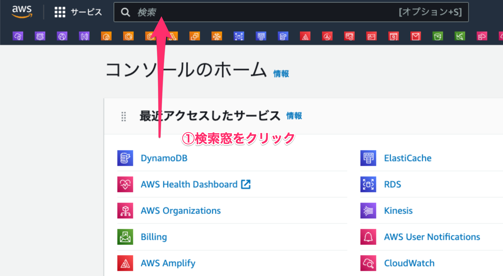
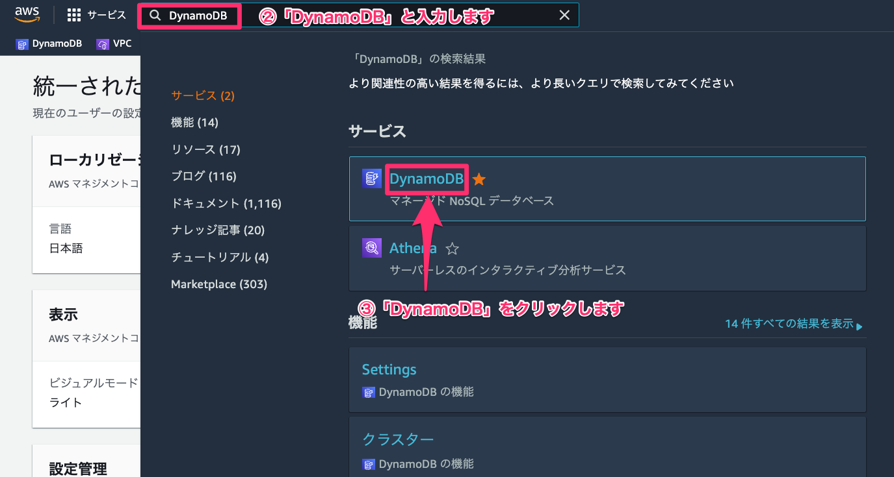
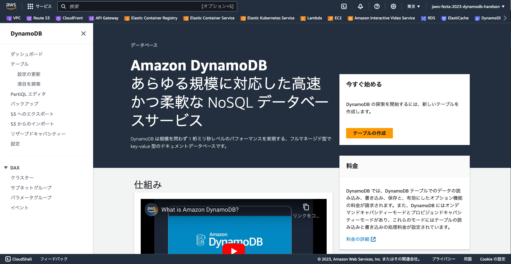
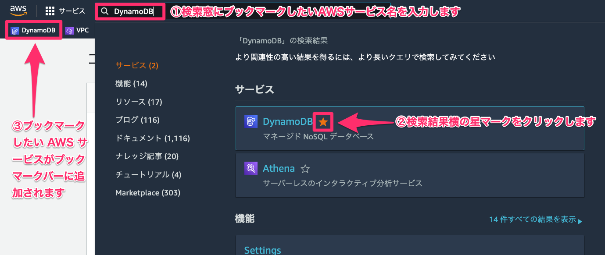
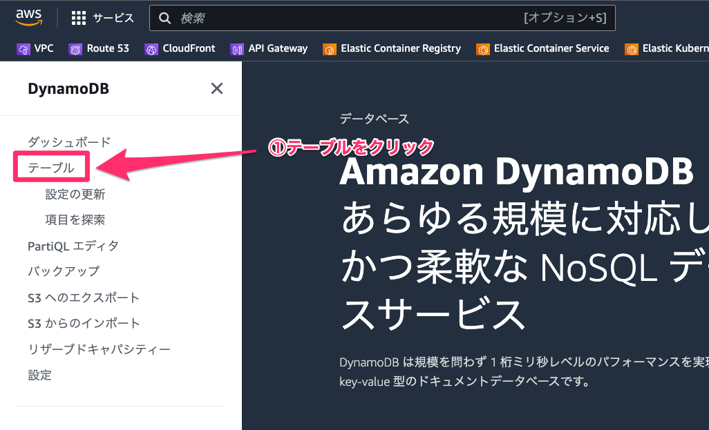
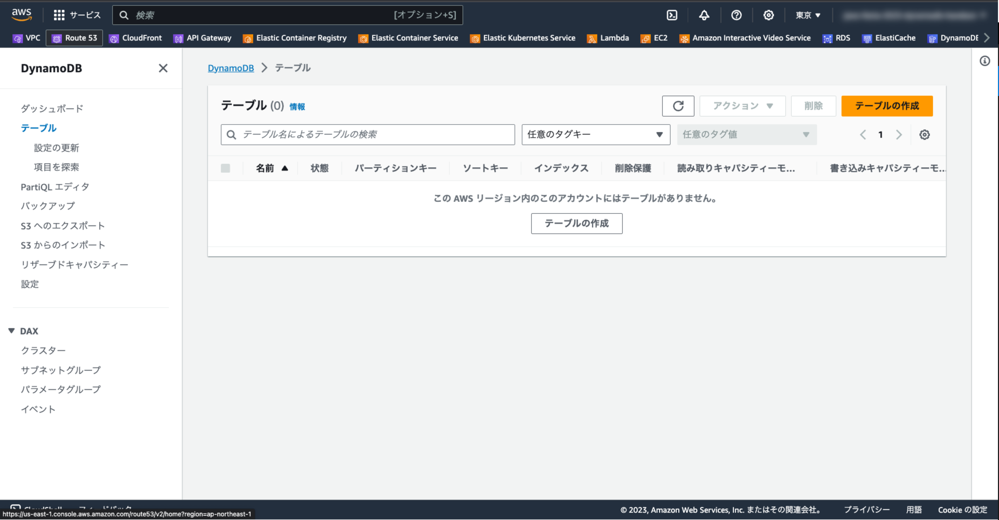
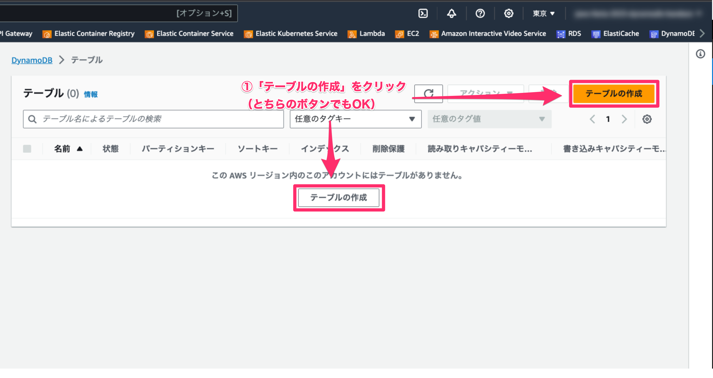

# はじめに

この資料は JAWS FESTA 2023 Kyushu で行われるハンズオンために書かれました。
イベントページは[こちら](https://jft2023.jaws-ug.jp/)。

# 自己紹介

- 登壇者名
  - ニッシー ☆ === 西勇樹（Nishi Yuki）
- 所属
  - 株式会社ユーザベース
  - ソーシャル経済メディア「NewsPicks」の Web 版を作っています。
- 登壇者概要
  - 会場である福岡工業大学を今年卒業しました。学生時代は月 1 でハッカソンに行きまくり、つど AWS などのクラウドサービスを利用して爆速でリリースサイクルを回せるような基盤づくりの実装を楽しんでいました。

---

- SNS リンク
  - 𝕏 (Twitter)：https://twitter.com/yukinissie
  - Facebook：https://www.facebook.com/yukinissie
  - GitHub：https://github.com/yukinissie

@[TOC](アジェンダ)

# 1. DynamoDB の基本[30]

## 1-1. 仕組み[5]

> DynamoDB は、一貫して 1 桁ミリ秒レベルのレイテンシーを必要とするあらゆる規模のアプリケーションに対応した、高速かつ柔軟な NoSQL データベースサービスです。DynamoDB はその柔軟性のあるデータモデルと信頼性の高いパフォーマンスにより、モバイル、ウェブ、ゲーム、広告技術、IoT といったアプリケーションに大いに活用できます。
>
> 引用：AWS コンソールのダッシュボード

###

## 1-2. 利点と機能[5]

###

## 1-3. ユースケース[5]

以下のような場所で使われている

- アドテック
- 小売り
- ソフトウェアとインターネット
- ゲーム
- メディアとエンターテイメント
- 銀行と金融

## 1-4. 料金 [5]

DynamoDB の料金の特徴は以下 3 つの通り

- データの読み取り、書き込み、保存リクエストに対して料金が請求がされる
- 利用するキャパシティーモードによって料金体系が異なる
- 有効にしたオプション機能の料金も追加で請求される

## 1-5. 公式ドキュメント[5]

安心安全公式ドキュメントのリンクはこちら ↓

- https://docs.aws.amazon.com/ja_jp/dynamodb/

例えば以下のようなものが載っています。

- [「DynamoDB の使用開始」](https://docs.aws.amazon.com/amazondynamodb/latest/developerguide/GettingStartedDynamoDB.html)
- [「DynamoDB へのアクセス」](https://docs.aws.amazon.com/amazondynamodb/latest/developerguide/AccessingDynamoDB.html)
- [「Programming with DynamoDB」](https://docs.aws.amazon.com/amazondynamodb/latest/developerguide/Programming.html)

## 1-6. その他のリソース[5]

# 2. 実際に触れてみよう[60]

## 2-1. DynamoDB サービストップページの開き方[5]

1. AWS コンソールにログインして、ヘッダーにある検索窓をクリックします。

2. 検索窓に「DynamoDB」と入力します。
3. 検索結果の中から「DynamoDB」をクリックします。

4. DynamoDB サービスのトップページが開きます。

## 2-2. 【余談】サービスのブックマークの仕方[5]

1. 検索窓にブックマークしたい AWS サービス名（例では「DynamoDB」）を入力します。
2. 検索結果横の星マークをクリックします。
3. ブックマークしたい AWS サービスがブックマークバーに追加されます。

## 2-3. テーブルの作成[15]

では早速、テーブルを作成していきましょう！

### 2-3-1. テーブル一覧を表示する[1]

1. DynamoDB サービスページの左にあるメニュー内の「テーブル」をクリックします。

2. そうすることでテーブル一覧を表示することができます。

### 2-3-2. テーブルを作成する[14]

1. 「テーブルの作成」をクリックします。

## 2-4. テーブルの更新[15]

## 2-5. 項目の探索[15]

## 2-6. お片付け[15]

# 3. まとめ[5]
